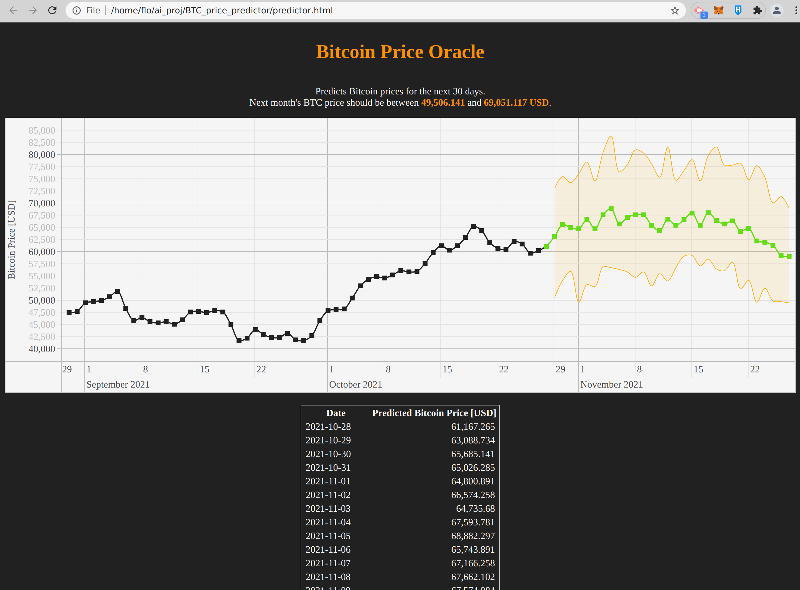

# Bitcoin Price Oracle

The Bitcoin Price Oracle is a web project utilizing the power of AWS DeepAR to predict future Bitcoin prices. 
Its able to predict BTC prices 30 days in the future. 
Its built using AWS Sagemaker and is using AWS S3, Lambda and API Gateway for deployment. 

This was my Capstone project for my ['Machine Learning Engineer Nanodegree Program' on Udacity](https://confirm.udacity.com/PKMX5GDH). 

## Building of model

To create and train the model you need to execute the steps in the jupyter notebook [BitcoinPricePrediction](BitcoinPricePrediction.ipynb) until the step of deploying the model as an endpoint in Sagemaker. 

## Deploying the backend

After the model is deployed you can create an AWS Lambda function with the [lambda_function.py](lambda_function.py) script as a source. It should have the role/permissions to access all Sagemaker resources in order to work properly. 
For that you can create a custom Role in IAM, ideally with 'AmazonSageMakerFullAccess'. 

## Creating the API
Finally with AWS API Gateway we need to create an API endpoint to be able to access the Lambda from the outside. You just need to create a new REST API and use the Lambda function you've just created as the backend. I created it as a simple endpoint with GET method. After configuring the endpoint you need to deploy it to get the endpoint URL wich should be used for the static website. 

## Setting up the static Web Page
Once the API is ready you can add the endpoint URL into the static web page [predictor.html](predictor.html) in line 113 as a parameter of the fetch function. Then you can either already check out the fancy Bitcoin Price Oracle locally by loading the web page into your browser or you can upload it for example on S3 and have it accessible for everyone. 
